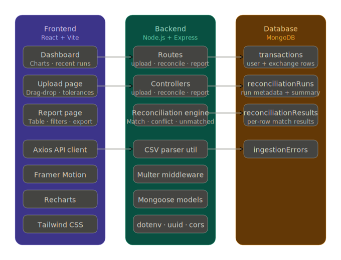

# CryptoRecon — Crypto Transaction Reconciliation Platform

A polished, production-quality fintech web application that reconciles crypto transactions between user records and exchange records. Built as a MERN-stack hackathon project with a claymorphism UI.

---

## 📸 System Workflow

### System Architecture


### Reconciliation Workflow


---

## 🚀 Quick Start

### Prerequisites

- Node.js >= 18
- MongoDB running locally on port 27017 (or provide a remote URI)

### 1. Clone and install dependencies

```bash
git clone <repo>
cd crypto-recon
npm run install:all
```

Or manually:

```bash
cd server && npm install
cd ../client && npm install
```

### 2. Configure environment variables

Edit `server/.env`:

```env
PORT=5000
MONGO_URI=mongodb://localhost:27017/crypto_recon
TIMESTAMP_TOLERANCE_SECONDS=300
QUANTITY_TOLERANCE_PCT=0.01
```

### 3. Run the app

Terminal 1 — Backend:

```bash
cd server
npm run dev
```

Terminal 2 — Frontend:

```bash
cd client
npm run dev
```

Open [http://localhost:3000](http://localhost:3000)

---

## 🏗️ Project Architecture

```
crypto-recon/
├── server/
│   ├── index.js                  # Express entry point
│   ├── .env                      # Environment variables
│   ├── controllers/
│   │   ├── uploadController.js   # CSV upload & parsing
│   │   ├── reconcileController.js# Reconciliation trigger
│   │   └── reportController.js   # Report queries
│   ├── routes/
│   │   ├── upload.js
│   │   ├── reconcile.js
│   │   └── report.js
│   ├── models/
│   │   ├── Transaction.js
│   │   ├── ReconciliationRun.js
│   │   ├── ReconciliationResult.js
│   │   └── IngestionError.js
│   ├── services/
│   │   └── reconciliationEngine.js  # Core matching logic
│   ├── middleware/
│   │   └── upload.js             # Multer config
│   └── utils/
│       └── csvParser.js          # CSV parsing + normalization
│
└── client/
    └── src/
        ├── App.jsx
        ├── main.jsx
        ├── index.css             # Tailwind + claymorphism styles
        ├── api/index.js          # Axios API client
        ├── layouts/Layout.jsx    # Sidebar + nav
        ├── pages/
        │   ├── Dashboard.jsx     # Overview + charts + recent runs
        │   ├── Upload.jsx        # File upload + tolerance config
        │   └── Report.jsx        # Full reconciliation report table
        └── components/
            ├── StatCard.jsx
            ├── StatusBadge.jsx
            ├── FileDropZone.jsx
            └── Pagination.jsx
```

---

## 🔁 Reconciliation Logic

### Asset Normalization

Assets are normalized before comparison:

| Input     | Normalized |
|-----------|-----------|
| bitcoin   | BTC       |
| ethereum  | ETH       |
| solana    | SOL       |
| tether    | USDT      |

Comparison is always case-insensitive.

### Transaction Type Mapping

`TRANSFER_OUT` on the user side is treated as equivalent to `TRANSFER_IN` on the exchange side, and vice versa.

### Matching Flow

1. **Exact match**: same asset, equivalent type, quantity within tolerance, timestamp within tolerance.
2. **Tolerance-based match**: same criteria but with configurable slack (default: ±300s, ±0.01%).
3. **Conflict detection**: asset and type match but quantity or timestamp is outside tolerance — flagged as conflicting.
4. **Unmatched classification**: remaining rows classified as `unmatched_user` or `unmatched_exchange`.

Duplicate matches are prevented — each exchange transaction can only match one user transaction.

### Result Categories

| Category          | Description                                             |
|-------------------|---------------------------------------------------------|
| `matched`         | Fully reconciled within tolerance                       |
| `conflicting`     | Asset/type match but quantity or timestamp discrepancy  |
| `unmatched_user`  | User transaction with no exchange counterpart           |
| `unmatched_exchange` | Exchange transaction with no user counterpart        |

---

## 📡 API Routes

| Method | Route                          | Description                        |
|--------|--------------------------------|------------------------------------|
| POST   | `/api/upload`                  | Upload CSVs (multipart/form-data)  |
| POST   | `/api/reconcile`               | Run reconciliation engine          |
| GET    | `/api/report/:runId`           | Full paginated report              |
| GET    | `/api/report/:runId/summary`   | Summary counts only                |
| GET    | `/api/report/:runId/unmatched` | Unmatched rows only                |

### POST /api/upload

Form fields:
- `user_file` — user transactions CSV
- `exchange_file` — exchange transactions CSV

Response:
```json
{
  "runId": "uuid",
  "userTransactions": 26,
  "exchangeTransactions": 25,
  "ingestionErrors": 0,
  "errors": []
}
```

### POST /api/reconcile

```json
{
  "runId": "uuid-from-upload",
  "timestampToleranceSec": 300,
  "quantityTolerancePct": 0.01
}
```

---

## 🗄️ Database Models

### Transaction
- `source`: `user` | `exchange`
- `txId`, `asset`, `type`, `quantity`, `priceUsd`, `fee`, `timestamp`
- `rawData`: original CSV row
- `runId`: upload batch ID

### ReconciliationRun
- `runId`, `status`, `timestampToleranceSec`, `quantityTolerancePct`
- `summary`: `{ matched, conflicting, unmatchedUser, unmatchedExchange, total, successRate }`

### ReconciliationResult
- `runId`, `category`, `reason`
- `userTransaction`, `exchangeTransaction`
- `quantityDiff`, `timestampDiffSec`
- `asset`, `type`, `quantity`, `timestamp`

### IngestionError
- `runId`, `source`, `rowNumber`, `reason`, `rawData`

---

## 🧠 Assumptions Made

1. Timestamps are ISO 8601 format; invalid timestamps cause the row to be marked as an ingestion error.
2. Asset aliases are one-directional (`bitcoin` → `BTC`); the normalized form is always used for matching.
3. A `TRANSFER_OUT` on the user side always corresponds to a `TRANSFER_IN` on the exchange side.
4. Price and fee fields are optional; missing values do not invalidate a transaction.
5. Quantity and timestamp tolerances can be overridden per reconciliation run via the UI or API.
6. The matching algorithm is greedy — it finds the best match per user transaction by minimizing timestamp difference.
7. Re-uploading creates a new `runId` batch; old data is not overwritten.

---

## 🛠️ Tech Stack

| Layer     | Technology                        |
|-----------|----------------------------------|
| Frontend  | React 18 + Vite, JSX only        |
| Styling   | Tailwind CSS, Claymorphism        |
| Animation | Framer Motion                    |
| Charts    | Recharts                         |
| HTTP      | Axios                            |
| Backend   | Node.js + Express                |
| Database  | MongoDB + Mongoose               |
| Upload    | Multer                           |
| CSV Parse | csv-parser                       |